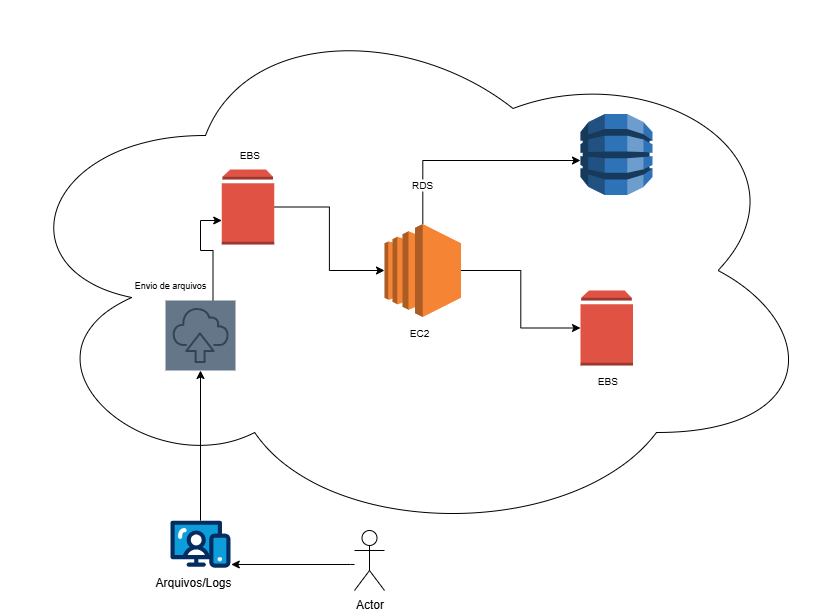

# Gerenciando Instâncias EC2 na AWS

Este repositório foi criado como parte do desafio **"Gerenciando Instâncias EC2 na AWS"** do Bootcamp Code Girls oferecido pelo Santander.  
O objetivo é documentar todo o aprendizado prático sobre gerenciamento de instâncias, consolidando conceitos e servindo como material de apoio para estudos futuros.  

##  Objetivo 

- Aplicar conceitos de **instâncias EC2 na AWS** em um ambiente prático.  
- Documentar os processos técnicos de forma **clara e organizada**.  
- Utilizar o GitHub como ferramenta de versionamento.

## Aprendizados 

- Criação e gerenciamento de instâncias **EC2**.  
- Configuração de **Security Groups** e permissões de acesso.  
- Conexão via **SSH** em instâncias Linux.  
- Criação e uso de **imagens AMI** personalizadas.  
- Gerenciamento de **Snapshots EBS** para backup.  
- Integração da EC2 com serviços como S3, AWS Lambda e RDS.  

###  Arquitetura 1: Integração S3 + EC2 + Lambda
Nessa arquitetura:  
- O usuário interage com a instância EC2.  
- Os dados são enviados para o  S3.  
- Um evento de notificação no S3 dispara uma função Lambda.  
- O Lambda processa os dados e armazena em outro bucket S3.  

 Diagrama:  

---

###  Arquitetura 2: EC2 com EBS e RDS
Nessa arquitetura:  
- O usuário envia arquivos/logs para o ambiente na nuvem.  
- A instância recebe esses arquivos e processa.  
- O armazenamento é feito nas unidades EBS.  
- Os dados estruturados são gravados em um banco relacional.  

 Diagrama:  

Os diagramas acima estão disponíveis na pasta `/images`, servindo como documentação visual do projeto.  
